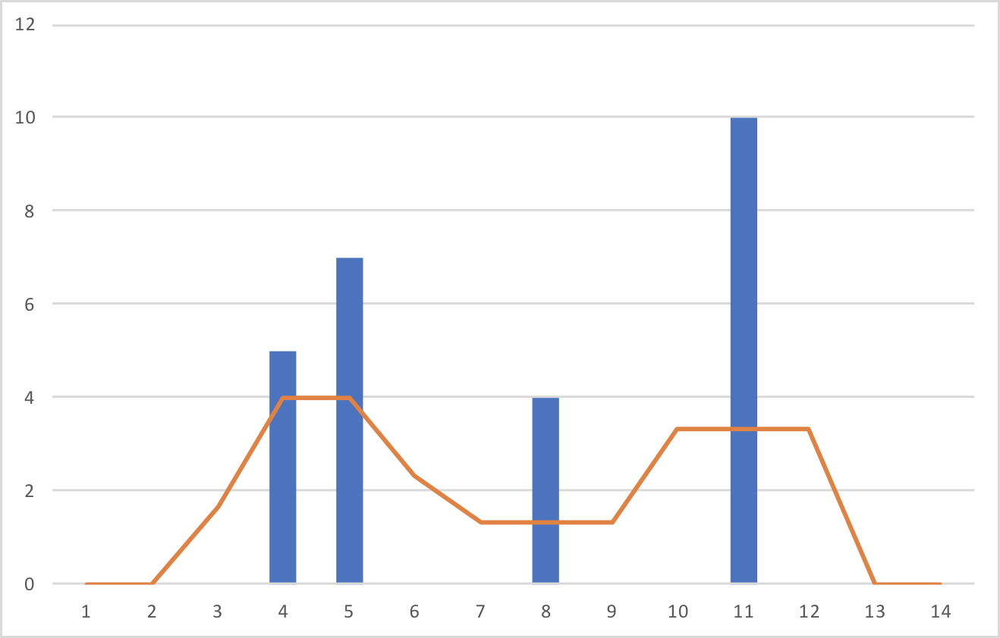
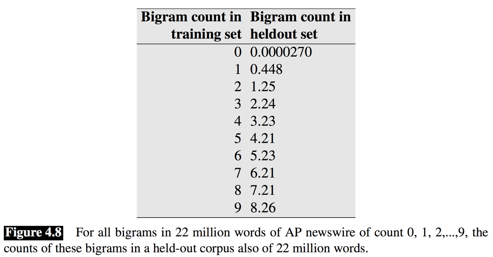

# N-gram

## Sparseness

이전 섹션에서 언어모델에 대해 소개를 간략히 했습니다. 하지만 만약 그 수식대로라면 우리는 확률들을 거의 구할 수 없을 것 입니다. 왜냐하면 비록 우리가 수천만~수억 문장을 인터넷에서 긁어 모았다고 하더라도, 애초에 출현할 수 있는 단어의 조합의 경우의 수는 무한대에 가깝기 때문입니다. 문장이 조금만 길어지더라도 Count를 구할 수 없어 분자가 0이 되어 확률이 0이 되거나, 심지어 분모가 0이 되어 정의할 수가 없어져버릴 것이기 때문입니다. 이렇게 너무나도 많은 경우의 수 때문에 생기는 문제를 희소성(sparseness or sparsity)문제라고 표현합니다.

## Markov Assumption

따라서 희소성(sparseness) 문제를 해결하기 위해서 Markov Assumption을 도입합니다.

$$
P(x_i|x_1,x_2,\cdots,x_{i-1}) \approx P(x_i|x_{i-k},\cdots,x_{i-1})
$$

Markov Assumption을 통해, 다음 단어의 출현 확률을 구하기 위해서, 이전에 출현한 모든 단어를 볼 필요 없이, 앞에 $k$ 개의 단어만 상관하여 다음 단어의 출현 확률을 구하도록 하는 것 입니다. 이렇게 가정을 간소화 하여, 우리가 구하고자 하는 확률을 근사(approximation) 하겠다는 것 입니다. 보통 $k$는 0에서 3의 값을 갖게 됩니다. 즉, $k = 2$ 일 경우에는 앞 단어 2개를 참조하여 다음 단어($x_i$)의 확률을 근사하여 나타내게 됩니다.

$$
P(x_i|x_{i-2},x_{i-1})
$$

이를 이전 chain rule(연쇄법칙) 수식에 적용하여, 문장에 대한 확률도 다음과 같이 표현 할 수 있습니다.

$$
P(x_1,x_2,\cdots,x_n) \approx \prod_{j=1}^{n}{P(x_j|x_{j-k},\cdots,x_{j-1})}
$$

이것을 log확률로 표현하면,

$$
\log{P(x_1,x_2,\cdots,x_n)} \approx \sum_{j=1}^{n}{log{P(x_j|x_{j-k},\cdots,x_{j-1})}}
$$

우리는 이렇게 전체 문장 대신에 바로 앞 몇 개의 단어만 상관하여 확률 계산을 간소화 하는 방법을 $n=k+1$으로 n-gram 이라고 부릅니다.

| k | n-gram | 명칭 |
| --- | --- | --- |
| 0 | 1-gram | uni-gram |
| 1 | 2-gram | bi-gram |
| 2 | 3-gram | tri-gram |

위 테이블과 같이 3-gram 까지는 tri-gram이라고 읽지만 4-gram 부터는 그냥 four-gram 이라고 읽습니다. 앞서 설명 하였듯이, $n$이 커질수록 우리가 가지고 있는 훈련 corpus내에 존재하지 않을 가능성이 많기 때문에, 오히려 확률을 정확하게 계산하는 데 어려움이 있을 수도 있습니다. \(예를 들어 훈련 corpus에 존재 하지 않는다고 세상에서 쓰이지 않는 문장 표현은 아니기 때문 입니다.\) 따라서 당연히 훈련 corpus의 양이 적을수록 $n$의 크기도 줄어들어야 합니다. 보통은 대부분 어느정도 훈련 corpus가 적당히 있다는 가정 하에서, 3-gram을 가장 많이 사용하고, 훈련 corpus의 양이 많을 때는 4-gram을 사용하기도 합니다. 하지만 이렇게 4-gram을 사용하면 언어모델의 성능은 크게 오르지 않는데 반해, 단어 조합의 경우의 수는 지수적(exponential)으로 증가하기 때문에, 사실 크게 효율성이 없습니다.

$$
P(x_i|x_{i-2},x_{i-1})=\frac{C(x_{i-2},x_{i-1},x_i)}{C(x_{i-2},x_{i-1})}
$$

이제 위와 같이 3개 단어의 출현 빈도와, 앞 2개 단어의 출현 빈도만 구하면 $x_i$의 확률을 근사할 수 있습니다. 즉, 아래와 같은 문장 전체의 확률에 대해서

$$
P(x_1, x_2, \cdots, x_n)
$$

비록 훈련 corpus 내에 해당 문장이 존재 한 적이 없더라도, Markov assumption을 통해서 우리는 해당 문장의 확률을 근사(approximation)할 수 있게 되었습니다.

## Generalization

머신러닝의 힘은 보지 못한 case에 대한 대처 능력, 즉 일반화(generalization)에 있습니다. 따라서, n-gram도 Markov assumption을 통해서 희소성(sparseness or sparsity)를 해결하는 일반화 능력을 갖게 되었다고 할 수 있습니다. 이제 우리는 이것을 좀 더 향상시킬 수 있는 방법을 살펴 보도록 하겠습니다.

### Smoothing \(Discounting\)

출현 횟수를 단순히 확률 값으로 이용 할 경우 문제점이 무엇이 있을까요? 바로 훈련 corpus에 출현하지 않는 단어 조합에 대한 대처 방법 입니다. 비록, markov assumption을 적용하여 우리는 희소성 문제를 훨씬 줄였고, 문장의 모든 단어 조합에 대해서 출현 횟수를 세지 않아도 되지만, 어찌되었든 그래도 훈련 corpus에 등장하지 않는 경우는 결국 존재 할 것인데, 그 경우인 훈련 셋에서 보지 못한 단어 조합(unseen word sequence)이라고 해서 등장 확률이 $0$이 되면 맞지 않습니다. 따라서 출현 횟수(counting) 값 또는 확률 값을 좀 더 다듬어 줘야 할 필요성이 있습니다. 아래 파란색 막대기와 같이 들쭉날쭉한 출현 횟수 값을 주황색 선으로 부드럽게(smooth) 바꾸어 주기 때문에 smoothing 또는 discounting이라고 불립니다. 그럼 그 방법에 대해 살펴보겠습니다.

#### Add one Smoothing

먼저 우리가 생각 해 볼 수 있는 가장 간단한 방법은, 모든 n-gram에 $1$을 더하는 것 입니다. 그렇다면 훈련셋에 출현하지 않은 n-gram의 경우에도 작은 확률이나마 가질 수 있을 것 입니다. 이를 수식으로 나타내면 아래와 같습니다.

$$
\begin{aligned}
P(w_i|w_{<i}) \approx \frac{C(w_{<i},w_i)+1}{C(w_{<i})+V}
\end{aligned}
$$

이처럼 $1$을 더하여 smoothing을 통해 $P(w_i|w_{<i})$를 근사할 수 있습니다. 이 수식을 좀 더 일반화하여 표현하면 아래와 같이 쓸 수 있습니다.

$$
\begin{aligned}
P(w_i|w_{<i}) &\approx \frac{C(w_{<i},w_i)+k}{C(w_{<i})+kV} \\
&\approx \frac{C(w_{<i},w_i)+(m/V)}{C(w_{<i})+m}
\end{aligned}
$$

이처럼, 1보다 작은 상수값을 더하여 smoothing을 구현 해 볼 수도 있을 것 입니다. 그렇다면 여기서 또 한발 더 나아가 1-gram prior 확률을 이용하여 좀 더 동적으로 대처 해 볼 수도 있을 것 입니다.

$$
P(w_i|w_{<i}) \approx \frac{C(w_{<i},w_i)+m P(w_i)}{C(w_{<i})+m}
$$

이처럼 add-one smoothing은 매우 간단하지만, 사실 언어모델처럼 희소성(sparseness) 문제가 큰 경우에는 부족합니다. 따라서 언어모델에 쓰이기에는 알맞은 방법은 아닙니다.

#### Absolute Smoothing

[[Church et al.1991](https://www.sciencedirect.com/science/article/pii/088523089190016J)]은 bigram에 대해서 실험을 한 결과를 제시하였습니다. 훈련용 corpus에서 $n$번 나타난 2-gram에 대해서, held-out corpus (validation or development set)에서 나타난 횟수를 세어 평균을 낸 것 입니다. 그 결과는 아래와 같습니다.

재미있게도, 0번과 1번 나타난 2-gram을 제외하면, 2번부터 9번 나타난 2-gram의 경우에는 held-out corpus에서의 출현 횟수는 훈련용 corpus 출현 횟수보다 약 0.75번 정도 적게 나타났다는 것 입니다. 즉, 출현 횟수(counting)에서 상수 $d$를 빼주는 것과 같다는 것입니다.

#### Kneser-Ney Smoothing

[[Kneser et al.1995](https://www.semanticscholar.org/paper/Improved-backing-off-for-M-gram-language-modeling-Kneser-Ney/9548ac30c113562a51e603dbbc8e9fa651cfd3ab)]은 여기에서 한발 더 나아가, KN discount를 제시하였습니다.

KN discounting의 주요 아이디어는 단어 $w$가 누군가($v$)의 뒤에서 출현 할 때, 얼마나 다양한 단어 뒤에서 출현하는지를 알아내는 것 입니다. 그래서 다양한 단어 뒤에 나타나는 단어일수록, 훈련셋에서 보지 못한 단어 조합(unseen word sequence)으로써 나타날 확률이 높다는 것 입니다.

- learning의 앞에 출현한 단어: machine, deep, supervised, unsupervised, generative, discriminative, ...
- laptop의 앞에 출현한 단어: slim, favorite, fancy, expensive, cheap, ...

예를 들어, 우리 책은 machine learning(기계학습)과 deep learning(딥러닝)을 다루는 책 이므로, 책 내에서 learning이라는 keyword의 빈도는 굉장히 높을 것 입니다. 하지만, 해당 단어는 주로 machine과 deep뒤에서만 나타났다고 해 보죠. learning이라는 단어에 비해서, laptop이라는 표현의 빈도는 낮을 것 입니다. 하지만 learning과 같이 특정 단어의 뒤에서 대부분 나타나기 보단, 자유롭게 나타났을 것 같습니다. KN discounting은 이 경우, laptop이 unseen word sequence에서 나타날 확률이 더 높다고 가정 하는 것 입니다. 한마디로 낯을 덜 가리는 단어를 찾아내는 것 입니다.

KN discounting은 $P_{continuation}$을 아래와 같이 모델링 합니다. 즉, $w$와 같이 나타난 $v$들의 집합의 크기가 클 수록 $P_{continuation}$은 클 것이라고 가정 합니다.

$$
P_{continuation}(w) \varpropto |\{ v : C(v, w) > 0 \}|
$$

위의 수식은 이렇게 나타내 볼 수 있습니다. $w$와 같이 나타난 $v$들의 집합의 크기를, $v$, $w'$가 함께 나타난 집합의 크기의 합으로 나누어 줍니다.

$$
P_{continuation}(w) = \frac{|\{ v : C(v, w) > 0 \}|}{\sum_{w'}{|\{ v : C(v, w') > 0 \}|}}
$$

이렇게 우리는 $P_{KN}$를 정의 할 수 있습니다.

$$
\begin{aligned}
P_{KN}(w_i|w_{i-1})=\frac{\max{(C(w_{i-1}, w_i) - d, 0)}}{C(w_{i-1})}+\lambda(w_{i-1})P_{continuation}(w_i), \\
where~\lambda(w_{i-1})=\frac{d}{\sum_v{C(w_{i-1}, v)}}\times|\{ w: c(w_{i-1}, w)>0 \}|.
\end{aligned}
$$

### Interpolation

Interpolation에 의한 generalization(일반화)을 살펴 보도록 하겠습니다. Interpolation은 두 다른 언어모델을 선형적으로 일정 비율($\lambda$)로 섞어 주는 것 입니다. Interpolation을 통해 얻을 수 있는 효과는, 일반 영역의 corpus를 통해 구축한 언어모델을, 필요에 따라 다른 특정 영역(domain)의 양이 적은 corpus를 통해 구축한 영역 특화(domain specific or adapted) 언어모델과 섞어 주는 것 입니다. 이를 통해 일반적인 언어 모델을 해당 영역에 특화 된 언어 모델로 만들 수 있습니다.

$$
\begin{aligned}
\tilde{P}(w_n|w_{n-k}, \cdots , w_{n-1}) = \lambda P_1(w_n|w_{n-k}, \cdots , w_{n-1}) + (1 - \lambda)P_2(w_n|w_{n-k}, \cdots , w_{n-1})
\end{aligned}
$$

예를 들어 의료 쪽 음성인식(ASR) 또는 기계번역(MT) 시스템을 구축한다고 가정 해 보겠습니다. 그렇다면 기존의 일반 영역 corpus를 통해 생성한 language model의 경우, 의료 용어 표현이 낯설 수도 있습니다. 하지만 만약 특화 영역의 corpus만 사용하여 언어모델을 생성할 경우, generalization 능력이 너무 떨어질 수도 있습니다.

- 일반 영역(general domain)
    - $P(진정제 | 준비, 된) = 0.00001$
    - $P(사나이 | 준비, 된) = 0.01$
- 특화 영역(specialized domain)
    - $P(진정제 | 준비, 된) = 0.09$
    - $P(약 | 준비, 된) = 0.04$
- Interpolated
    - $P(진정제 | 준비, 된) = 0.5 * 0.09 + (1 – 0.5) * 0.00001 = 0.045005$

따라서 일반적인 대화에서와 다른 의미를 지닌 단어가 나올 수도 있고, 일반적인 대화에서는 희소(rare)한 표현(word sequence)가 훨씬 더 자주 등장 할 수 있습니다. 이런 상황들에 잘 대처하기 위해서 해당 영역 corpus로 생성한 언어모델을 섞어주어 해당 영역(domain)에 특화 시킬 수 있습니다.

### Back-off

너무 긴 단어 조합(word sequence)은 실제 훈련 corpus에서 굉장히 희소(rare, sparse)하기 때문에, 우리는 Markov assumption을 통해서 일반화(generalization) 할 수 있었습니다. 그럼 그것을 응용해서 좀 더 나아가 보도록 하겠습니다.

아래 수식을 보면 특정 n-gram의 확률을 $n$보다 더 작은 시퀀스에 대해서 확률을 구하여 선형결합(linear combination)을 계산 하는 것을 볼 수 있습니다. 아래와 같이 $n$보다 더 작은 시퀀스에 대해서도 확률을 가져옴으로써 smoothing을 통해 일반화 효과를 좀 더 얻을 수 있습니다. 사실 따라서 이 방법도 interpolation의 일종이라고 볼 수 있습니다.

$$
\begin{aligned}
\tilde{P}(w_n|w_{n-k}, \cdots , w_{n-1}) = &\lambda_1 P(w_n|w_{n-k}, \cdots , w_{n-1}) \\
&+ \lambda_2 P(w_n|w_{n-k+1}, \cdots , w_{n-1}) \\
&+ \cdots \\
&+ \lambda_k P(w_n), \\ \\

where~&\sum_i{\lambda_i}=1.
\end{aligned}
$$

또한, 다음 단어를 예측 해 내는 추론(inference)에서도, 훈련 corpus에 존재하지 않는 (unseen) n-gram에 대해서도 훈련 corpus에 나타났던 단어 시퀀스(word sequence)가 있을 때까지 back-off하여, 다음 단어의 확률을 예측 해 볼 수 있습니다.

## Conclusion

n-gram 방식은 출현 횟수(count)를 통해 확률을 근사하기 때문에 굉장히 쉽고 간편합니다. 대신에 단점도 명확합니다. 훈련 corpus에 등장하지 않은 단어 조합은 확률을 정확하게 알 수 없습니다. 따라서 Markov assumption을 통해서 단어 조합에 필요한 조건을 간소화 시키고, 더 나아가 Smoothing과 Back-off 방식을 통해서 남은 단점을 보완하려 했습니다만, 이 또한 근본적인 해결책은 아니므로 실제로 음성인식이나 통계기반 기계번역에서 쓰이는 언어모델 어플리케이션 적용에 있어서 큰 난관으로 작용하였습니다. 하지만, 워낙 간단하고 명확하기 때문에 성공적으로 음성인식, 기계번역 등에 정착하였고 십 수년 동안 널리 사용되어 왔습니다.