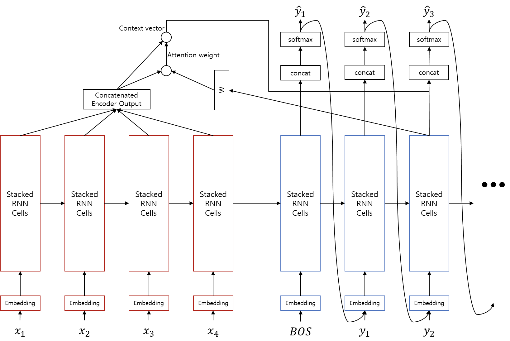
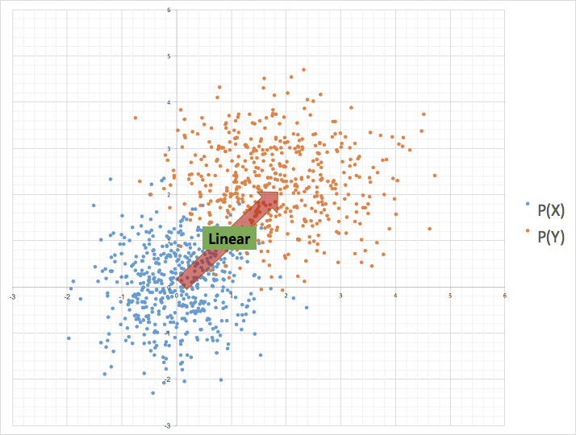

# Attention

## Motivation

한 문장으로 Attention을 정의하면 ***쿼리(Query)와 비슷한 값을 가진 키(Key)를 찾아서 그 값(Value)을 얻는 과정*** 입니다. 따라서, 우리가 흔히 json이나 프로그래밍에서 널리 사용하는 Key-Value 방식과 비교하며 attention에 대해서 설명 하겠습니다.

### Key-Value function

Attention을 본격 소개하기 전에 먼저 우리가 알고 있는 자료형을 짚고 넘어갈까 합니다. Key-Value 또는 [Python에서 Dictionary](https://wikidocs.net/16)라고 부르는 자료형 입니다.

```py
>>> dic = {'computer': 9, 'dog': 2, 'cat': 3}
```

위와 같이 Key와 Value에 해당하는 값들을 넣고 Key를 통해 Value 값에 접근 할 수 있습니다. 좀 더 바꿔 말하면, Query가 주어졌을 때, Key 값에 따라 Value 값에 접근 할 수 있습니다. 위의 작업을 함수로 나타낸다면, 아래와 같이 표현할 수 있을겁니다. \(물론 실제 Python Dictionary 동작은 매우 다릅니다.\)

```py
def key_value_func(query):
    weights = []

    for key in dic.keys():
        weights += [is_same(key, query)]
        
    weight_sum = sum(weights)
    for i, w in enumerate(weights):
        weights[i] = weights[i] / weight_sum

    answer = 0

    for weight, value in zip(weights, dic.values()):
        answer += weight * value

    return answer

def is_same(key, query):
    if key == query:
        return 1.
    else:
        return .0
```

코드를 살펴보면, 순차적으로 **dic** 내부의 key값들과 query 값을 비교하여, key가 같을 경우 **weights** 에 1.0을 추가하고, 다를 경우에는 0.0을 추가합니다. 그리고 weights를 weights의 총 합으로 나누어 weights의 합이 1이 되도록 (마치 확률과 같이) normalize하여 줍니다. 다시 **dic** 내부의 value값들과 weights의 값을 inner product \(스칼라곱, dot product\) 합니다. 즉, $weight = 1.0$ 인 경우에만 value 값을 **answer**에 더합니다.

### Differentiable Key-Value function

좀 더 발전시켜서, 만약 **is same** 함수 대신에 다른 함수를 써 보면 어떻게 될까요? **how similar** 라는 key와 query 사이의 유사도를 리턴 해 주는 가상의 함수가 있다고 가정해 봅시다.

```py
>>> query = 'puppy'
>>> how_similar('computer', query)
0.1
>>> how_similar('dog', query)
0.9
>>> how_similar('cat', query)
0.7
```

그리고 해당 함수에 'puppy'라는 단어를 테스트 해 보았더니 위와 같은 값들을 리턴해 주었다고 해 보겠습니다. 그럼 아래와 같이 실행 될 겁니다.

```py
>>> query = 'puppy'
>>> key_value_func(query)
2.823 # = .1 / (.9 + .7 + .1) * 9 + .9 / (.9 + .7 + .1) * 2 + .7 / (.9 + .7 + .1) * 3
```

**2.823** 라는 값이 나왔습니다. 강아지와 고양이, 그리고 컴퓨터의 유사도의 비율에 따른 dic의 값의 비율을 지녔다라고 볼 수 있습니다. **is same** 함수를 쓸 때에는 두 값이 같은지 if문을 통해 검사하고 값을 할당했기 때문에, 미분을 할 수 없거나 할 수 있더라도 gradient가 0이 됩니다. 하지만, 이제 우리는 key\_value\_func을 미분 할 수 있습니다.

### Differentiable Key-Value Vector function

* 만약, **dic** 의 value에는 100차원의 vector로 들어있었다면 어떻게 될까요? 
* 거기에, query와 key 값 모두 vector라면 어떻게 될까요? 즉, Word Embedding Vector라면?
* **how similar** 함수는 이 vector 들 간의 cosine similarity를 반환 해 주는 함수라면?
* 그리고, **dic** 의 key 값과 value 값이 서로 같다면 어떻게 될까요?

그럼 다시 가상의 함수를 만들어보겠습니다. **word2vec** 함수는 단어를 입력으로 받아서 그 단어에 해당하는 미리 정해진 word embedding vector를 반환 해 준다고 가정하겠습니다. 그럼 좀 전의 **how similar** 함수는 두 vector 간의 cosine similarity 값을 반환 할 겁니다.

```py
def key_value_func(query):
    weights = []

    for key in dic.keys():
        weights += [how_similar(key, query)]    # cosine similarity 값을 채워 넣는다.

    weights = softmax(weights)    # 모든 weight들을 구한 후에 softmax를 계산한다.
    answer = 0

    for weight, value in zip(weights, dic.values()):
        answer += weight * value

    return answer
```

이번에 key\_value\_func는 그럼 그 값을 받아서 weights에 저장 한 후, 모든 weights의 값이 채워지면 softmax를 취할 겁니다. 여기서 softmax는 weights의 합의 크기를 1로 고정시키는 normalization의 역할을 합니다. 따라서 similarity의 총 합에서 차지하는 비율 만큼 weight의 값이 채워질 겁니다.

```py
>>> len(word2vec('computer'))
100
>>> word2vec('dog')
[0.1, 0.3, -0.7, 0.0, ...
>>> word2vec('cat')
[0.15, 0.2, -0.3, 0.8, ...
>>> dic = {word2vec('computer'): word2vec('computer'), word2vec('dog'): word2vec('dog'), word2vec('cat'): word2vec('cat')}
>>>
>>> query = 'puppy'
>>> answer = key_value_func(word2vec(query))
```

그럼 이제 answer의 값에는 어떤 vector 값이 들어 있을 겁니다. 그 vector는 'puppy' vector와 'dog', 'computer', 'cat' vector들의 코사인 유사도에 따라서 값이 정해집니다.

즉, 이 함수는 query와 비슷한 key 값을 찾아서 비슷한 정도에 따라서 weight를 나누고, 각 key의 value값을 weight 값 만큼 가져와서 모두 더하는 것 입니다. 이것이 Attention이 하는 역할 입니다.

## Attention for Machine Translation task

### Overview

그럼 번역에서 attention은 어떻게 작용할까요? 번역 과정에서는 encoder의 각 time-step 별 출력을 Key와 Value로 삼고, 현재 time-step의 decoder 출력을 Query로 삼아 attention을 취합니다.

* Query: 현재 time-step의 decoder output
* Keys: 각 time-step 별 encoder output
* Values: 각 time-step 별 encoder output

```py
>>> context_vector = attention(query = decoder_output, keys = encoder_outputs, values = encoder_outputs)
```

Attention을 추가한 seq2seq의 수식은 아래와 같은부분이 추가/수정 됩니다.

$$
w = softmax({h_{t}^{tgt}}^T W \cdot H^{src})
$$
$$
c = H^{src} \cdot w~~~~~and~c~is~a~context~vector
$$
$$
\tilde{h}_{t}^{tgt}=\tanh(linear_{2hs \rightarrow hs}([h_{t}^{tgt}; c]))
$$
$$
\hat{y}_{t}=softmax(linear_{hs \rightarrow |V_{tgt}|}(\tilde{h}_{t}^{tgt}))
$$
$$
where~hs~is~hidden~size~of~RNN,~and~|V_{tgt}|~is~size~of~output~vocabulary.
$$

원하는 정보를 attention을 통해 encoder에서 획득한 후, 해당 정보를 decoder output과 concatenate하여 $tanh$를 취한 후, softmax 계산을 통해 다음 time-step의 입력이 되는 $\hat{y}_{t}$을 구합니다.



### Linear Transformation

이때, 각 input parameter들은 다음을 의미한다고 볼 수 있습니다.

1. decoder\_output: 현재 time-step 까지 번역 된 target language 단어들 또는 문장, 의미
2. encoder\_outputs: 각 time-step 에서의 source language 단어 또는 문장, 의미

사실 신경망 내부의 각 차원들은 숨겨진 특징값(latent feature)이므로 딱 잘라 정의할 수 없습니다. 하지만 분명한건, source 언어와 target 언어가 다르다는 것 입니다. 따라서 단순히 dot product를 해 주기보단 source 언어와 target 언어 간에 연결고리를 하나 놓아주어야 합니다. 그래서 우리는 두 언어의 embedding hyper plane이 선형(linear) 관계에 있다고 가정하고, dot product 하기 전에 선형 변환(linear transformation)을 해 줍니다.



위와 같이 꼭 번역이 아니더라도, 두 다른 도메인(domain) 사이의 변환을 위해서 사용합니다.

### Why


왜 Attention이 필요한 것일까요? 기존의 seq2seq는 두 개의 RNN\(encoder와 decoder\)로 이루어져 있습니다. 여기서 압축된 문장의 의미에 해당하는 encoder의 정보를 hidden state \(LSTM의 경우에는 + cell state\)의 vector로 전달해야 합니다. 그리고 decoder는 그 정보를 이용해 다시 새로운 문장을 만들어냅니다. 이 때, hidden state만으로는 문장의 정보를 완벽하게 전달하기 힘들기 때문입니다. 따라서 decoder의 각 time-step 마다, 시간을 뛰어넘어, hidden state의 정보에 따라 필요한 encoder의 정보에 접근하여 끌어다 쓰겠다는 것 입니다.

### Evaluation

](../assets/nmt-attention-evaluation-graph.png)

Attention을 사용하지 않은 seq2seq는 전반적으로 성능이 떨어짐을 알수 있을 뿐만 아니라, 특히 문장이 길어질수록 성능이 더욱 하락함을 알 수 있습니다. 하지만 이에 비해서 attention을 사용하면 문장이 길어지더라도 성능이 크게 하락하지 않음을 알 수 있습니다.

## Code

```python
class Attention(nn.Module):

    def __init__(self, hidden_size):
        super(Attention, self).__init__()

        self.linear = nn.Linear(hidden_size, hidden_size, bias = False)
        self.softmax = nn.Softmax(dim = -1)

    def forward(self, h_src, h_t_tgt, mask = None):
        # |h_src| = (batch_size, length, hidden_size)
        # |h_t_tgt| = (batch_size, 1, hidden_size)
        # |mask| = (batch_size, length)

        query = self.linear(h_t_tgt.squeeze(1)).unsqueeze(-1)
        # |query| = (batch_size, hidden_size, 1)

        weight = torch.bmm(h_src, query).squeeze(-1)
        # |weight| = (batch_size, length)
        if mask is not None:
            # Set each weight as -inf, if the mask value equals to 1.
            # Since the softmax operation makes -inf to 0, masked weights would be set to 0 after softmax operation.
            # Thus, if the sample is shorter than other samples in mini-batch, the weight for empty time-step would be set to 0.
            weight.masked_fill_(mask, -float('inf'))
        weight = self.softmax(weight)

        context_vector = torch.bmm(weight.unsqueeze(1), h_src)
        # |context_vector| = (batch_size, 1, hidden_size)

        return context_vector
```