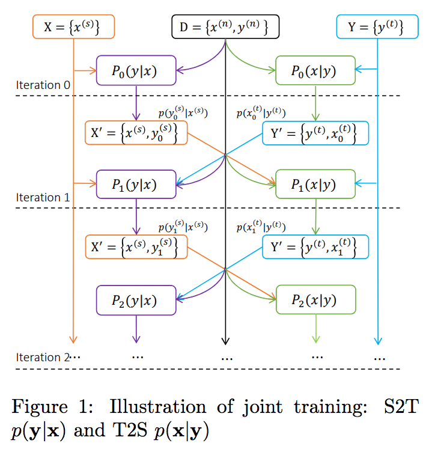
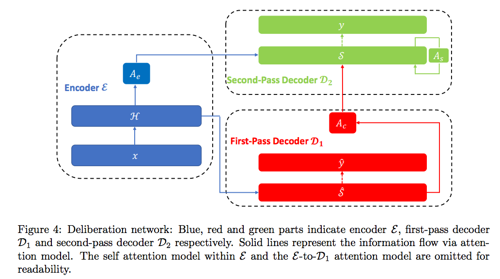
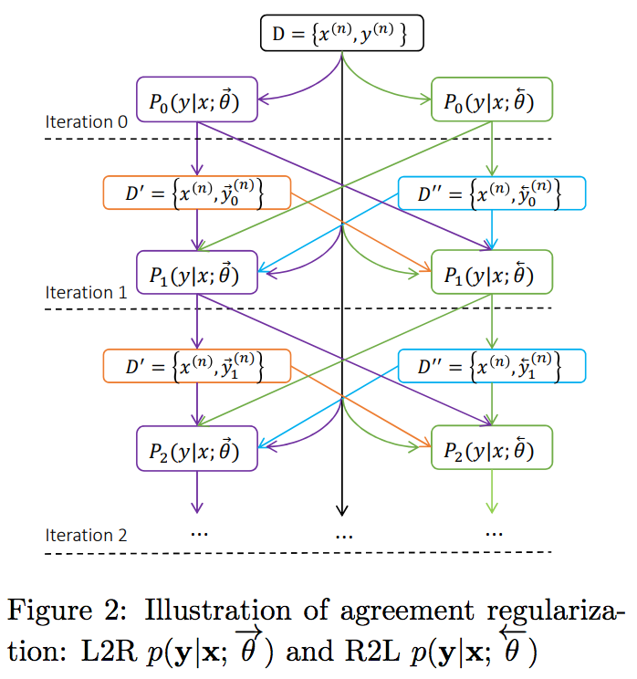

# Microsoft Machine Translation
(Achieving Human Parity on Automatic Chinese to English News Translation)

2018년 3월에 나온 Microsoft의 기계번역 시스템에 대한 논문\(\[[Hassan et al.,2018](https://arxiv.org/pdf/1803.05567.pdf)\]\)입니다. 2016년에 발표한 Google의 논문은 기계번역 자체의 기본 성능을 끌어올리는 모델 아키텍쳐와 훈련 방법 등의 내부 구조에 대해서 많은 설명을 할애하였던 것과 달리, Microsoft의 논문은 기술을 이미 끌어올려진 기술의 기반 위에서 더욱 그 성능을 견고히하는 방법에 대한 설명에 분량을 더 할애하였습니다.

이 논문은 중국어와 영어 간 기계번역 시스템을 다루고 있고, 뉴스 도메인(domain) 번역에 있어서 사람의 번역과 비슷한 성능에 도달하였다고 선언하고 있습니다. 다만, 제안한 방법에 의해 구성된 기계번역 시스템이 모든 언어쌍에 대해서, 모든 분야의 도메인에 대해서 같은 사람 번역 수준에 도달하지는 못할 수도 있다고 설명하고 있습니다.

Microsoft는 전통적인\(?\) RNN방식의 seq2seq 대신, Google의 Transformer 구조를 사용하여 seq2seq를 구현하였습니다. 이 논문에서 소개한 중점 기술은 아래와 같습니다.

* Back-translation과 Dual learning\(Unsupervised and Supervised, both\)을 통한 단방향(monolingual) corpora의 활용 극대화
* Auto-regressive 속성\(이전 time-step의 예측(prediction)이 다음 time-step의 예측에 영향을 주는 것\)의 단점을 보완하기 위한 Deliberation Networks\(\[[Xia et al.,2017](https://papers.nips.cc/paper/6775-deliberation-networks-sequence-generation-beyond-one-pass-decoding.pdf)\]\)과 Kullback-Leibler \(KL\) divergence를 이용한 regularization
* NMT성능을 극대화 하기 위한 훈련 데이터 선택(selection)과 필터링(filtering)

위의 기술들에 대해서 한 항목씩 차례로 살펴보도록 하겠습니다.

## Exploiting the Dual Nature of Translation

### Dual Learning for NMT

이 논문에서는, 앞 챕터에서 설명한, duality를 활용하여 양방향(bilingual) corpus를 활용한 [Dual Supervised Learning \(DSL\) \[Xia et al.2017\]](https://arxiv.org/pdf/1707.00415.pdf) 방식과, 단방향(monolingual) corpus를 marginal 분포(distribution)에 적용하여 활용한 [Dual Unsupervised Learning (DUL) [Wang et al.2017]](https://www.microsoft.com/en-us/research/wp-content/uploads/2017/11/17041-72820-1-SM.pdf) 방식을 모두 사용하였습니다.

#### Dual Unsupervised Learning \(DUL\)

$$
\begin{aligned}
\mathcal{L}(x;\theta_{x \rightarrow y})&=E_{y \sim P(\cdot|x;\theta_{x \rightarrow y})}\{\log{P(x|y;\theta_{y \rightarrow x})}\} \\
&= \sum_{y}{P(y|x;\theta_{x \rightarrow y})\log{P(x|y;\theta_{y \rightarrow x})}}
\end{aligned}
$$

$$
\frac{\partial\mathcal{L}(x;\theta_{x \rightarrow y})}{\partial\theta_{x \rightarrow y}} = \sum_{y}{\frac{\partial P(y|x;\theta_{x \rightarrow y})}{\partial\theta_{x \rightarrow y}}\log{P(x|y;\theta_{y \rightarrow x})}}
$$

#### Dual Supervised Learning \(DSL\)

### Joint Training of Src2Tgt and Tgt2Src Models

## Beyond the Left-to-Right Bias

### Deliberation Networks

Microsoft는 [[Xia et al.2017]](https://www.microsoft.com/en-us/research/wp-content/uploads/2017/12/6775-deliberation-networks-sequence-generation-beyond-one-pass-decoding.pdf)에서 소개한 방식을 통해 번역 성능을 더욱 높이려 하였습니다. 이 방법은 사람이 번역을 하는 방법에서 영감을 얻은 것 입니다. 사람은 번역을 할 때에 source 문장에서 초안(draft) target 문장을 얻고, 그 초안으로부터 최종적인 target 문장을 번역 해 내곤 합니다. 따라서 신경망을 통해 같은 방법을 구현하고자 하였습니다.

예를 들어 기존의 번역의 수식은 deliberation networks를 통해 아래와 같이 바뀔 수 있습니다.

$$
P(Y|X)=\prod{P(y_i|X,y_{<i})} \longrightarrow P(Y|X)=\prod{P(y_i|X,Y_{mid},y_{<i})}
$$

### Agreement Regularization of Left-to-Right and Right-to-Left Models

## Data Selection and Filtering

## Evaluation

