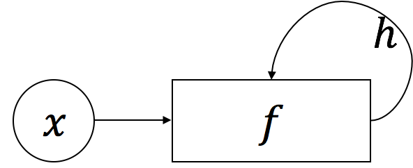
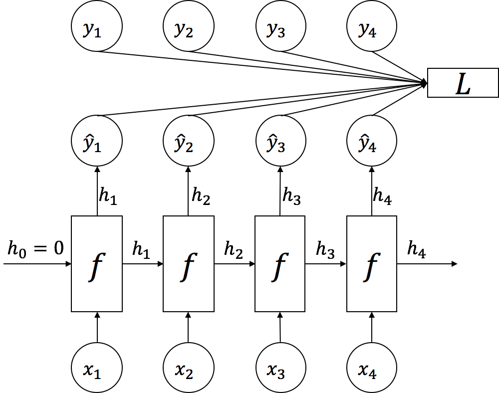
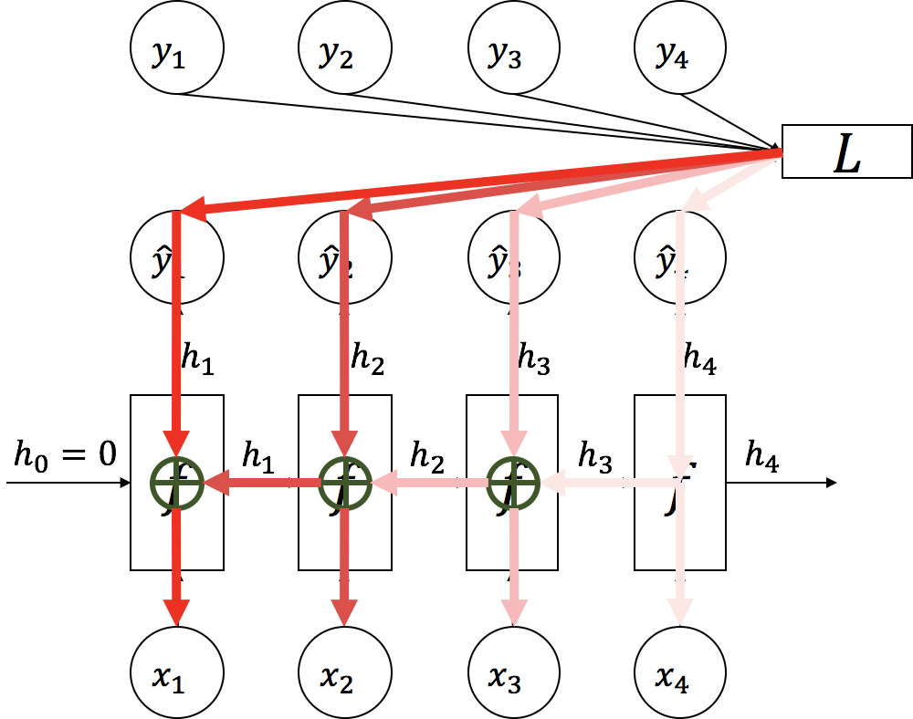
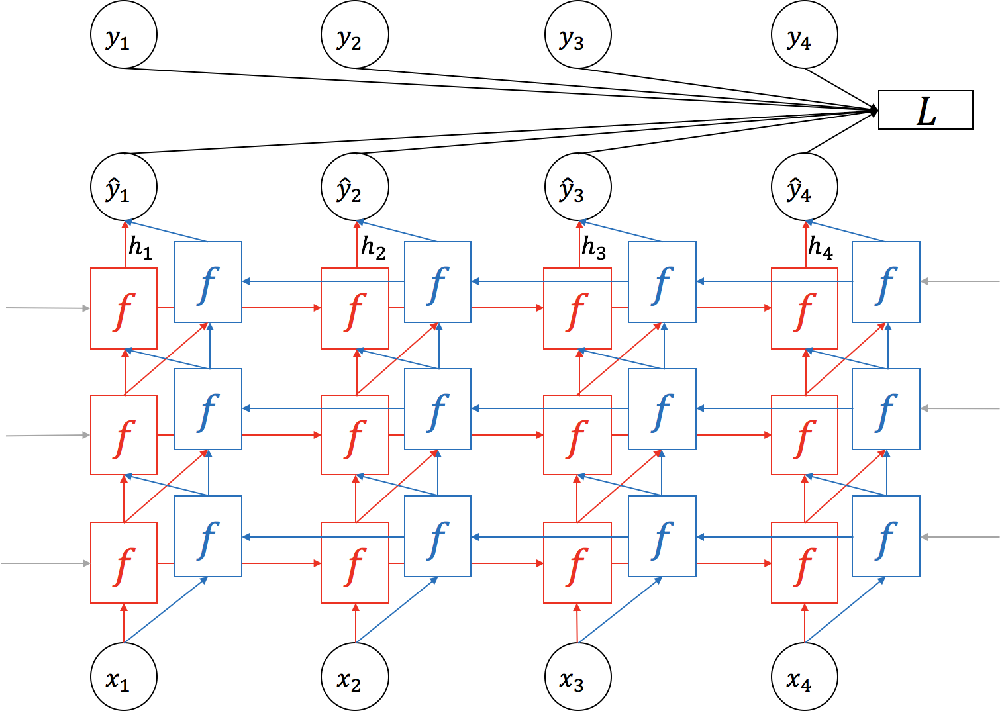

# \(Vanilla\) Recurrent Neural Network

기존 신경망은 정해진 입력 $x$를 받아 $y$를 출력해 주는 형태였습니다.

$$
y=f(x)
$$

하지만 recurrent neural network \(순환신경망, RNN\)은 입력 $x_t$와 직전 자신의 상태\(hidden state\) $h_{t-1}$를 참조하여 현재 자신의 상태 $h_t$를 결정하는 작업을 여러 time-step에 걸쳐 수행 합니다. 각 time-step별 RNN의 상태는 경우에 따라 출력이 되기도 합니다.

$$
h_t=f(x_t, h_{t-1})
$$

### Feed-forward

기본적인 RNN을 활용한 feed-forward 계산의 흐름은 아래와 같습니다. 아래의 그림은 각 time-step 별로 입력 $x_t$와 이전 time-step의 $h_t$가 RNN으로 들어가서 출력으로 $h_t$를 반환하는 모습입니다. 이렇게 얻어낸 $h_t$들을 $\hat{y}_t$로 삼아서 정답인 $y_t$와 비교하여 손실(loss) $\mathcal{L}$을 계산 합니다.

위 그림을 수식으로 표현하면 아래와 같습니다. 함수 $f$는 $x_t$와 $h_{t-1}$을 입력으로 받아서 파라미터 $\theta$를 통해 $h_t$를 계산 합니다. 이때, 각 입력과 출력 그리고 내부 파라미터의 크기는 다음과 같습니다. -- $x_t \in \mathbb{R}^w, h_t \in \mathbb{R}^d, W_{ih} \in \mathbb{R}^{d \times w}, b \in \mathbb{R}^{d}, W_{hh} \in \mathbb{R}^{d \times d}, b_{hh} \in \mathbb{R}^{d}$

$$
\begin{aligned}
\hat{y}_t=h_t&=f(x_t,h_{t-1};\theta) \\
&=\tanh(W_{ih} x_t + b_{ih} + W_{hh} h_{t-1} + b_{hh}) \\
&where~\theta=[W_{ih};b_{ih};W_{hh};b_{hh}].
\end{aligned}
$$

위의 수식에서 나타나듯이 RNN에서는 ReLU나 다른 활성함수(activation function)을 사용하기보단 $\tanh$를 주로 사용합니다. 최종적으로 각 time-step별로 $y_t$를 계산하여 아래의 수식처럼 모든 time-step에 대한 손실(loss) $\mathcal{L}$을 구합니다.

$$
\mathcal{L}=\frac{1}{n}\sum_{t=1}^{n}{loss(y_t,\hat{y}_t)}
$$

## Back-propagation Through Time (BPTT)

그럼 이렇게 feed-forward 된 이후에 오류의 back-propagation(역전파)은 어떻게 될까요? 우리는 수식보다 좀 더 개념적으로 접근 해 보도록 하겠습니다.

각 time-step의 RNN에 사용된 파라미터 $\theta$는 모든 시간에 공유되어 사용 되는 것을 기억 해 봅시다. 따라서, 앞서 구한 손실 $\mathcal{L}$에 미분을 통해 back-propagation 하게 되면, 각 time-step 별로 뒤($t$가 큰 time-step)로부터 $\theta$의 gradient가 구해지고, 이전 time-step ($t-1$) $\theta$의 gradient에 더해지게 됩니다. 즉, $t$가 $0$에 가까워질수록 RNN 파라미터 $\theta$의 gradient는 각 time-step 별 gradient가 더해져 점점 커지게 됩니다.

$$
\frac{\partial{\mathcal{L}}}{\partial{\theta}}=\sum_{t}{\frac{\partial{loss(y_t,\hat{y}_t)}}{\partial{\theta}}}
$$

위 그림에서는 붉은색이 점점 짙어지는 것으로 그런 RNN back-propagation의 속성을 나타내었습니다. 이 속성을 back-propagation through time(BPTT)이라고 합니다.

이런 RNN back-propagation의 속성으로 인해, 마치 RNN은 time-step의 수 만큼 layer(계층)이 있는 것이나 마찬가지가 됩니다. 따라서 time-step이 길어짐에 따라, 매우 깊은 신경망과 같이 동작 합니다.

## Gradient Vanishing

상기 했듯이, BPTT로 인해 RNN은 마치 time-step 만큼의 layer가 있는 것과 비슷한 속성을 띄게 됩니다. 그런데 위의 RNN의 수식을 보면, 활성함수(activation function)으로 $\tanh$(Hyperbolic Tangent, '탄에이치'라고 읽기도 합니다.)가 사용 된 것을 볼 수 있습니다. $\tanh$은 아래와 같은 형태를 띄고 있습니다.

$\tanh$의 양 끝은 수평에 가깝게되어 점점 $-1$ 또는 $1$에 근접하는 것을 볼 수 있습니다. 문제는 이렇게 되면, $\tanh$ 양 끝의 gradient는 0에 가까워진다는것 입니다. 따라서 $\tanh$ 양 끝의 값을 반환하는 레이어의 경우에는 gradient가 0에 가깝게 되어, 그 다음으로 back-propgation 되는 레이어는 제대로 된 gradient를 전달 받을 수가 없게 됩니다. 이를 gradient vanishing이라고 합니다.

따라서, time-step이 많거나 여러층으로 되어 있는 신경망의 경우에는 이 gradient vanishing 문제가 쉽게 발생하게 되고, 이는 딥러닝 이전의 신경망 학습에 큰 장애가 되곤 하였습니다.

## Multi-layer RNN

기본적으로 Time-step별로 RNN이 동작하지만, 아래의 그림과 같이 한 time-step 내에서 RNN을 여러 층을 쌓아올릴 수 있습니다. 그림상으로 시간의 흐름은 왼쪽에서 오른쪽으로 간다면, 여러 레이러를 아래에서 위로 쌓아 올릴 수 있습니다. 따라서 여러개의 RNN 레이어가 쌓여 하나의 RNN을 이루고 있을 때, 가장 위층의 hidden state가 전체 RNN의 출력값이 됩니다.

당연히 각 층 별로 파라미터 $\theta$를 공유하지 않고 따로 갖습니다. 보통은 각 레이어 사이에 dropout을 끼워 넣기도 합니다.

기존의 단층 RNN의 경우에는 hidden state와 출력값이 같은 값이었지만, 여러 층이 쌓여 이루어진 RNN의 경우에는 각 time-step의 출력값이 맨 윗층의 hidden state가 됩니다.

## Bi-directional RNN

여러 층을 쌓는 방법에 대해 이야기 했다면, 이제 RNN의 방향에 대해서 이야기 할 차례 입니다. 이제까지 다룬 RNN은 $t$가 $1$에서부터 마지막 time-step 까지 차례로 입력을 받아 진행 하였습니다. 하지만, bi-directional(양방향) RNN을 사용하게 되면, 기존의 정방향과 추가적으로 마지막 time-step에서부터 거꾸로 역방향으로 입력을 받아 진행 합니다. Bi-directional RNN의 경우에도 당연히 정방향과 역방향의 파라미터 $\theta$는 공유되지 않습니다.

보통은 여러 층의 bi-directional RNN을 쌓게 되면, 각 층마다 두 방향의 각 time-step 별 출력(hidden state)값을 이어붙여(concatenate) 다음 층(layer)의 각 방향 별 입력으로 사용하게 됩니다. 경우에 따라서 전체 RNN 레이어들 중에서 일부 층만 bi-directional을 사용하기도 합니다.

## How to Apply to NLP

그럼 위에서 다룬 내용을 바탕으로 RNN을 NLP를 비롯한 실무에서는 어떻게 적용하는지 알아보도록 하겠습니다. 여기서는 RNN을 한개 층만 쌓아 정방향으로만 다룬 것 처럼 묘사하였지만, 여러 층을 양방향으로 쌓아 사용하는 것도 대부분의 경우 가능 합니다.

### Use only last hidden state as output

가장 쉬운 사용케이스로 마지막 time-step의 출력값만 사용하는 경우입니다.

가장 흔한 예제로 그림의 감성분석과 같이 텍스트 분류(text classification)의 경우에 단어(토큰)의 갯수 만큼 입력이 RNN에 들어가고, 마지막 time-step의 결과값을 받아서 softmax 함수를 통해 해당 입력 텍스트의 클래스(class)를 예측하는 확률 분포를 근사(approximate)하도록 동작 하게 됩니다.

$$
\text{softmax}(x_{i}) = \frac{exp(x_i)}{\sum_j exp(x_j)}
$$

이때, 각 time-step 별 입력 단어 $x_t$는 one-hot vector로 표현(encoded)되고 임베딩 레이어(embedding layer)를 거쳐 정해진 차원의 word 임베딩 벡터로 표현되어 RNN에 입력으로 주어지게 됩니다. 마찬가지로 정답 클래스 또한 one-hot 벡터가 되어 cross entropy 손실함수(loss function)를 통해 softmax 결과값인 각 클래스 별 확률을 나타낸 ([multinoulli](https://www.statlect.com/probability-distributions/multinoulli-distribution)) 확률 분포 벡터와 비교하여 손실(loss)값을 구하게 됩니다.

$$
\text{CrossEntropy}(y_{1:n}, \hat{y}_{1:n})=\frac{1}{n}\sum_{i=1}^{n}{y_i^T\hat{y}_i}
$$

### Use all hidden states as output

그리고 또 다른 많이 이용되는 방법은 모든 time-step의 출력값을 모두 사용하는 것 입니다. 우리는 이 방법을 언어모델(language modeling)이나 기계번역(machine translation)으로 실습 해 볼 것이지만, 굳이 그런 방법이 아니어도, 문장을 입력으로 주고, 각 단어 별 형태소를 분류(classification)하는 문제라던지 여러가지 방법으로 응용이 가능합니다.

그림과 같이 각 time-step 별로 입력을 받아 RNN을 거치고 나서, 각 time-step별로 어떠한 결과물을 출력 하여, 각 time-step 별 정답과 비교하여 손실(loss)를 구합니다. 이때에도 각 단어는 one-hot 벡터로 표현 될 수 있으며, 그 경우에는 임베딩 레이어를 거쳐 word 임베딩 벡터로 변환 된 후, RNN에 입력으로 주어지게 됩니다.

대부분의 경우 RNN은 여러 층(layer)과 양방향(bi-directional)으로 구현 될 수 있습니다. 하지만 입력과 출력이 같은 데이터를 공유 하는 경우에는 bi-directional RNN을 사용할 수 없습니다. 좀 더 구체적으로 설명하면 이전 time-step이 현재 time-step의 입력으로 사용되는 모델 구조의 경우에는 bi-directional RNN을 사용할 수 없습니다. 위의 그림도 그 경우에 해당 합니다. 하지만 형태소 분류기와 같이 출력이 다음 time-step에 입력에 영향을 끼치지 않는 경우에는 bi-directional RNN을 사용할 수 있습니다.

## Conclusion

위와 같이 RNN은 가변길이의 입력을 받아 가변길이의 출력을 내어줄 수 있는 모델 입니다. 하지만 기본(Vanilla) RNN은 time-step이 길어질 수록 앞의 데이터를 기억하지 못하는 치명적인 단점이 있습니다. 이를 해결하기 위해서 Long Short Term Memory (LSTM)이나 Gated Recurrent Unit (GRU)와 같은 응용 아키텍쳐들이 나왔고 훌륭한 개선책이 되어 널리 사용되고 있습니다.