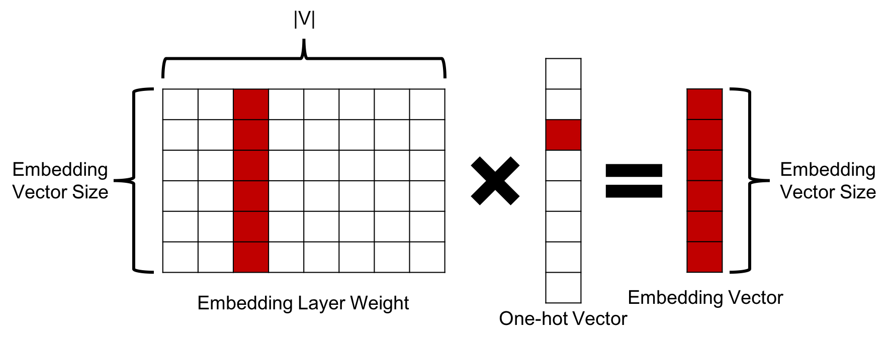

# Myth

우리는 이번 챕터를 통해 단어를 벡터로 표현하는 방법에 대해서 살펴보았습니다. One-hot encoding의 sparse 벡터를 차원 축소하여 훨씬 작은 차원의 dense 벡터로 표현하는 방법에 대해 다루었습니다. 

하지만 많은 분들이 헷갈려 하는 부분이 있다면, 이렇게 훈련한 단어 임베딩 벡터를 추후 우리가 다룰 텍스트 분류, 언어모델, 번역 등의 딥러닝 모델들의 입력으로 사용할 것이라고 생각한다는 점 입니다.

Word2Vec을 통해 얻은 단어 임베딩 벡터는 훌륭하게 단어의 특성을 잘 반영하고 있지만, 텍스트 분류, 언어모델, 번역의 문제 해결을 위한 최적의 벡터 임베딩이라고는 볼 수 없습니다.

예를 들어 긍정/부정 분류를 하는 텍스트 분류 문제의 경우에는 '행복'이라는 단어가 매우 중요한 특징(feature)가 될 것이고, 이를 표현하기 위한 임베딩 벡터가 존재할 것 입니다. 하지만 영화 시놉시스의 장르를 분류하기 위한 문제에서는 '행복'이라는 단어는 다른 특징으로 작용 될 것이며, 이 분류 문제를 위한 '행복' 단어의 임베딩 벡터의 값은 이전 긍정/부정 분류 문제의 값과 당연히 달라지게 될 것 입니다. 따라서 문제의 특성을 고려하지 않은 단어 임베딩 벡터는 그다지 좋은 방법이 될 수 없습니다.

## How to get word embedding instead of using Word2Vec

우리는 Word2Vec을 사용하지 않더라도, 문제의 특성에 맞는 단어 임베딩을 구할 수 있습니다. PyTorch를 비롯한 여러 딥러닝 프레임워크는 Embedding Layer라는 레이어 아키텍처를 제공합니다.

이 레이어는 아래와 같이 bias가 없는 Linear Layer와 같은 형태를 갖고 있습니다.

$$
y=\text{emb}(x)=Wx
$$

따라서 입력으로 one-hot vector가 주어지게 되면, $W$의 특정 column(구현 방법에 따라 또는 row)만 반환하게 됩니다.

따라서 최종적으로 모델으로부터 구한 손실값(loss)에 따라 back-propagation 및 gradient descent를 수행하게 되면, 자동적으로 embedding layer의 weight $W$의 값을 구할 수 있게 될 것 입니다.

물론 실제 구현에 있어서는 이렇게 큰 embedding layer weight와 one-hot 벡터를 곱하는 것은 매우 비효율적이므로, 단순히 테이블에서 lookup하는 작업을 수행 합니다. 따라서 우리는 단어를 나타냄에 있어 (embedding layer의 입력으로) one-hot 벡터를 굳이 넘겨줄 필요 없이, $1$이 존재하는 단어의 index 정수 값만 입력으로 넘겨주면 embedding vector를 얻을 수 있습니다.

추후 실제 앞으로 우리가 다룰 텍스트 분류나 기계번역 챕터에서 구현된 것을 살펴보면, 위에서 말한대로 embedding layer를 사용하여 구현한 것을 알 수 있습니다.