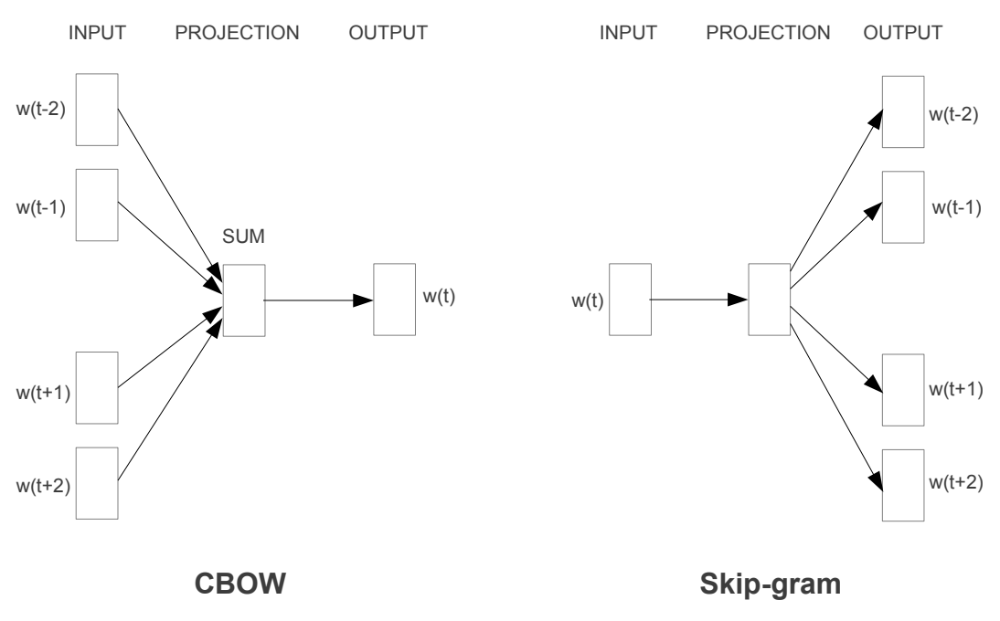
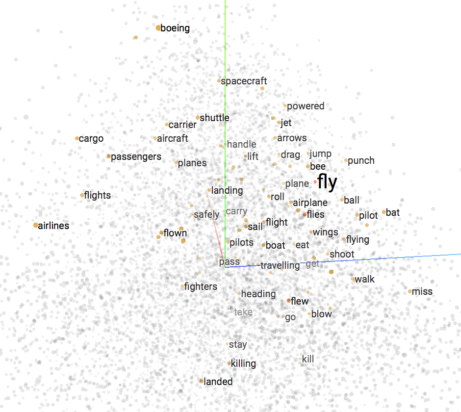

# Word2Vec

2011년 Tomas Milokov는 Word2Vec이라는 방법을 제시하여 학계에 큰 파장을 일으켰습니다. 물론 이전부터 Neural Network를 통해 단어를 임베딩하고자 하는 시도는 많았지만, 빠르고 쉽고 효율적으로 임베딩하는 word2vec을 통해, 딥러닝 연구자들의 자연어처리에 대한 이해도를 한단계 끌어올렸습니다.

Word2Vec은 단어를 임베딩 하는 방법을 2가지 제시하였습니다. 두 방법 모두 공통된 가정을 갖고 있습니다. 두 방법에 사용된 가정은 함께 나타나는 단어가 비슷할 수록 비슷한 벡터 값을 가질 것이라는 것 입니다.

위와 같이 두 방법 모두 윈도우(window)의 크기가 주어지면, 특정 단어를 기준으로 윈도우 내의 주변 단어들을 사용하여 단어 임베딩을 학습합니다. 단, 윈도우 내에서의 위치는 고려되지 않습니다. 하지만 이때 단어의 위치 정보가 무시되는 것은 아닙니다. 윈도우 자체가 단어의 위치 정보를 내포하고 있기 때문입니다. 문장 내 단어의 위치에 따라서 윈도우에 포함되는 단어가 달라질 것이기 때문입니다.

## CBOW

CBOW는 주변에 나타나는 단어를 입력으로 주어 해당 단어를 예측하도록 하는 신경망 구조를 가진 모델을 통해 단어 임베딩을 학습합니다.

## Skip-gram

Skip-gram은 단어를 입력으로 주어 주변에 나타나는 단어를 예측하도록 하는 신경망 구조를 가진 모델을 통해 단어 임베딩을 학습합니다.

보통 Skip-gram이 CBOW보다 성능이 뛰어난 것으로 알려져 있고, 따라서 좀 더 널리 쓰입니다.

