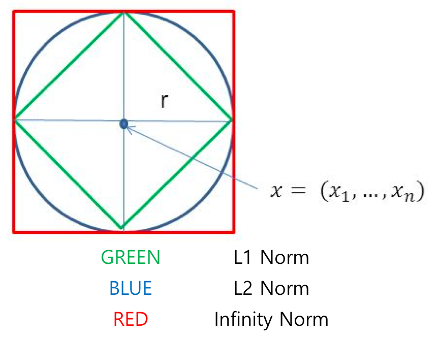

# Using Other Features for Similarity

이번엔 다른 방식으로 단어의 유사도를 구하는 방법에 접근 해보겠습니다. 자체적으로 단어에 대한 특성(feature)들을 모아 feature vector로 만들거나 유사도(similarity)를 계산하는 연산을 통해 단어간의 유사도를 구하는 방법입니다. 지금이야 어렵지않게 단어를 vector 형태로 embedding 할 수 있지만, 딥러닝 이전의 시대에는 쉽지 않은 일이었습니다. 이번 섹션을 통해서 딥러닝 이전의 전통적인 방식의 단어간의 유사도를 구하는 방법에 대해 알아보고, 이 방법의 단점과 한계에 대해서 살펴보겠습니다.

## Collecting Features

먼저, feature vector를 구성하는 방법들에 대해 살펴보고자 합니다. 결국 아래의 방법들이 하고자 하는 일은 같은 조건에 대해서 비슷한 수치를 반환하는 단어는 비슷한 유사도를 갖도록 벡터를 구성하는 것이라고 할 수 있습니다.

### Term-Frequency Matrix

앞서 우리는 TF-IDF에 대해서 살펴 보았습니다. TF-IDF에서 사용되었던 TF (term frequency)는 훌륭한 피쳐(feature)가 될 수 있습니다. 예를 들어 어떤 단어가 각 문서별로 출현한 횟수가 차원별로 구성되면, 하나의 feature vector를 이룰 수 있습니다. 물론 각 문서별 TF-IDF 자체를 사용하는 것도 좋습니다.

```python
vocab = {}
tfs = []
for d in docs:
    vocab = get_term_frequency(d, vocab)
    tfs += [get_term_frequency(d)]

from operator import itemgetter
import numpy as np
sorted_vocab = sorted(vocab.items(), key=itemgetter(1), reverse=True)

stats = []
for v, freq in sorted_vocab:
    tf_v = []
    for idx in range(len(docs)):
        if tfs[idx].get(v) is not None:
            tf_v += [tfs[idx][v]]
        else:
            tf_v += [0]

    print('%s\t%d\t%s' % (v, freq, '\t'.join(['%d' % tf for tf in tf_v])))
```

위의 코드를 사용하여 단어들의 각 문서별 출현횟수를 나타내면 아래와 같습니다.

|단어($w$)|TF($w$)|TF($w,d_1$)|TF($w,d_2$)|TF($w,d_3$)|
|-|-|-|-|-|
|는|47|15|14|18|
|을|39|8|10|21|
|이|32|8|8|16|
|은|15|6|2|7|
|가|14|1|7|6|
|여러분|12|5|6|1|
|말|11|5|1|5|
|남자|9|9|0|0|
|여자|7|5|0|2|
|차이|7|5|2|0|
|요인|6|0|6|0|
|겁니다|5|2|1|2|
|얼마나|5|4|1|0|
|심리학|5|5|0|0|
|학습|5|0|4|1|
|이야기|5|0|1|4|
|결과|5|0|4|1|
|실제로|4|2|1|1|
|능력|4|3|1|0|
|멀리|4|4|0|0|
|시험|4|0|4|0|
|환경|4|0|4|0|
|사람|3|1|0|2|
|동일|3|2|1|0|
|유형|3|0|3|0|
|인증|3|0|3|0|
|유전자|3|0|3|0|
|수행|3|0|2|1|
|연구|3|0|2|1|
|유전|3|0|3|0|
|쌍둥이|3|0|3|0|
|경우|3|0|3|0|
|모두|3|0|1|2|
|공유|3|0|3|0|
|인지|3|0|1|2|
|참여|3|0|0|3|
|몸짓|3|0|0|3|
|거짓말|3|0|0|3|

여기서 마지막 3개 column이 각 단어별 문서에 대한 출현횟수를 활용한 feature vector가 될 것 입니다. 지금은 문서가 3개밖에 없기 때문에, 사실 정확한 feature vector를 구성했다고 하기엔 무리가 있습니다. 하지만, 문서가 많다면 우리는 지금보다 더 나은 feature vector를 구할 수 있을 것 입니다.

물론, 문서가 많아도 아직 한계가 있습니다. 단순히 문서에서의 출현 횟수를 가지고 feature vector를 구성하였기 때문에, 많은 정보가 유실되었고, 굉장히 단순화되어 여전히 매우 정확한 feature vector를 구성하였다고 하기엔 무리가 있습니다.

### Based on Context Window (Co-occurrence)

함께 나타나는 단어들을 활용한 방법 입니다. 의미가 비슷한 단어라면 쓰임새가 비슷할 것 입니다. 또한, 쓰임새가 비슷하기 때문에, 비슷한 문장 안에서 비슷한 역할로 사용될 것이고, 따라서 함께 나타나는 단어들이 유사할 것 입니다. 이러한 관점에서 우리는 함께 나타나는 단어들이 유사한 단어들의 유사도를 높게 주도록 만들어 줄 것 입니다.

함께 나타나는 단어들을 조사하기 위해서, 우리는 Context Window를 사용하여 windowing을 실행 합니다. (windowing이란 window를 움직이며 window안에 있는 유닛들의 정보를 취합하는 방법을 이릅니다.) 각 단어별로 window 내에 속해 있는 이웃 단어들을 counting하여 matrix로 나타내는 것 입니다.

이 방법은 좀 전에 다룬 문서 내의 단어 출현 횟수(term frequency)를 가지고 feature vector를 구성한 방식보다 좀 더 정확하다고 할 수 있습니다. 하지만, window의 크기라는 하나의 hyper-parameter가 추가되어, 사용자가 그 크기를 정해주어야 합니다. 만약 window의 크기가 너무 크다면, 현재 단어와 너무 관계가 없는 단어들까지 counting 될 수 있습니다. 하지만, 너무 작은 window 크기를 갖는다면, 관계가 있는 단어들이 counting되지 않을 수 있습니다. 따라서, 적절한 window 크기를 정하는 것이 중요 합니다. 또한, window를 문장을 벗어나서도 적용 시킬 것인지도 중요합니다. 문제에 따라 다르지만 대부분의 경우에는 window를 문장 내에만 적용합니다.

python 코드를 통해 아래와 같은 문장들에 대해서 우리는 windowing을 수행 할 수 있습니다.

```python
```

그리고 이 코드를 통해 얻은 결과는 아래와 같습니다.

## Get Similarity between Feature Vectors

### Manhattan Distance (L1 distance)

$$
\text{d}_{\text{L1}}(w,v)=\sum_{i=1}^d{|w_i-v_i|},\text{ where }w,v\in\mathbb{R}^d.
$$

### Euclidean Distance (L2 distance)

$$
\text{d}_{\text{L2}}(w,v)=\sqrt{\sum_{i=1}^d{(w_i-v_i)^2}},\text{ where }w,v\in\mathbb{R}^d.
$$


### Using Infinity Norm

$$
d_{\infty}(w,v)=\max(|w_1-v_1|,|w_2-v_2|,\cdots,|w_d-v_d|),\text{ where }w,v\in\mathbb{R}^d
$$



### Pointwise Mutual Information

$$
\text{PMI}(w,v)=\log{\frac{P(w,v)}{P(w)P(v)}}
$$

### Positive PMI (PPMI)

$$
\text{PPMI}(w,v)=\max(0, \text{PMI}(w, v))
$$

### Cosine Similarity

$$
\begin{aligned}
\text{sim}_{\text{cos}}(w,v)&=\overbrace{\frac{w\cdot v}{|w||v|}}^{\text{dot product}}
=\overbrace{\frac{w}{|w|}}^{\text{unit vector}}\cdot\frac{v}{|v|} \\
&=\frac{\sum_{i=1}^{d}{w_iv_i}}{\sqrt{\sum_{i=1}^d{w_i^2}}\sqrt{\sum_{i=1}^d{v_i^2}}} \\
\text{where }&w,v\in\mathbb{R}^d
\end{aligned}
$$

위와 같은 수식을 갖는 cosine similarity(코사인 유사도)함수는 두 벡터 사이의 방향과 크기를 모두 고려하는 방법 입니다. 수식에서 분수의 윗변은 두 벡터 사이의 element-wise 곱을 사용하므로 벡터의 내적과 같습니다. 따라서 cosine similarity의 결과가 $1$에 가까울수록 방향은 일치하고, $0$에 가까울수록 수직(orthogonal)이며, $-1$에 가까울수록 반대 방향임을 의미 합니다. 위와 같이 cosine similarity는 크기와 방향 모두를 고려하기 때문에, 자연어처리에서 가장 널리 쓰이는 유사도 측정 방법 입니다. 하지만 수식 내 윗변의 벡터 내적 연산이나 밑변 각 벡터의 크기(L2 norm)를 구하는 연산이 비싼 편에 속합니다. 따라서 vector 차원의 크기가 클수록 연산량이 부담이 됩니다.

### Jaccard Similarity

$$
\begin{aligned}
\text{sim}_{\text{jaccard}}(w,v)&=\frac{|w \cap v|}{|w \cup v|} \\
&=\frac{|w \cap v|}{|w|+|v|-|w \cap v|} \\
&\approx\frac{\sum_{i=1}^d{\min(w_i,v_i)}}{\sum_{i=1}^d{\max(w_i,v_i)}} \\
\text{where }&w,v\in\mathbb{R}^d.
\end{aligned}
$$

Jaccard similarity는 두 집합 간의 유사도를 구하는 방법 입니다. 수식의 윗변에는 두 집합의 교집합의 크기가 있고, 이를 밑변에서 두 집합의 합집합의 크기로 나누어 줍니다. 이때, Feature vector의 각 차원이 집합의 element가 될 것 입니다. 다만, 각 차원에서의 값이 $0$ 또는 $0$이 아닌 값이 아니라, 수치 자체에 대해서 Jaccard similarity를 구하고자 할 때에는, 두번째 줄의 수식과 같이 두 벡터의 각 차원의 숫자에 대해서 $\min$, $\max$ 연산을 통해서 계산 할 수 있습니다.

## Appendix: Similarity between Documents

https://web.stanford.edu/class/cs124/lec/sem

https://www.cs.princeton.edu/courses/archive/fall16/cos402/lectures/402-lec10.pdf